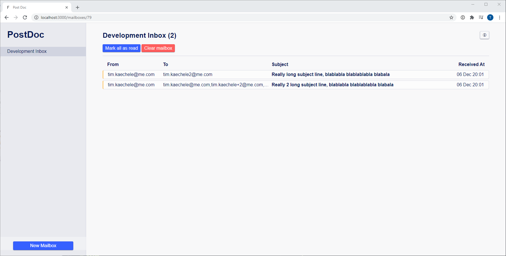

# PostDoc

PostDoc is a sendgrid mock api server that allows you to test your dynamic
sendgrid templates in development or staging environments written in Ruby on Rails.

## What it does?

It provides you with a mock api for sending emails and an accompanying web interface
to inspect the sent emails.

It validates the request payload with the sendgrid sandbox mode to check
that all inputs are correct and then renders your html/plain text handlebars
templates with the provided personalizations.

## What you need?

- a valid sendgrid api token

## Configuration

PostDoc generates a mock sendgrid api token for you, that you have to pass to
your sendgrid api client library, additionally you have to override the host with
the host where you run postdoc.

In ruby that looks something like this:

```ruby
SendGrid::API.new(api_key: 'YOUR_POSTDOC_MOCK_TOKEN',
                  host: 'POSTDOC_HOST')
```

## Dependencies

- Ruby Version (MRI) 2.7.2
- Postgresql 12.3
- Node

## Setup

Install the correct ruby version

```shell
$ rvm install 2.7.2
```

Install the ruby dependencies

```shell
$ bundle install --jobs=64
```

Create your database file and fill in your postgres username/password

```shell
$ cp config/database.yml.example config/database.yml
```

Setup the database

```shell
$ bundle exec rails db:setup
```

Install the frontend dependencies

```shell
$ yarn install --check-files
```

Start a server

```shell
$ bundle exec rails server
```

## Credentials

The username/password for accessing the user interface in development mode
are:

```txt
username: postdoc
password: postdoc
```

You can override them in `config/secrets`.

## Screenshots


